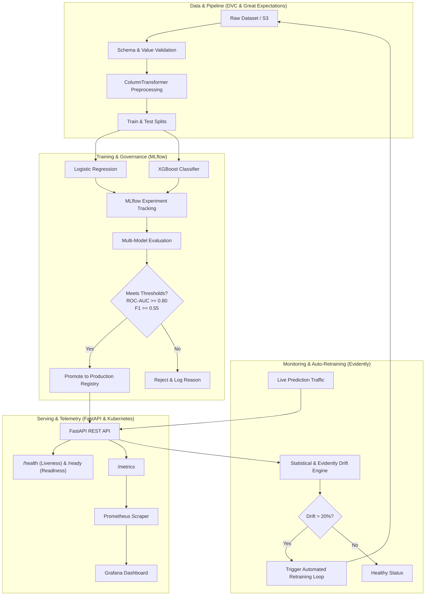

# ChurnFlow: Production-Grade Customer Churn Prediction MLOps Platform

[](.github/workflows/ci.yml)
[](https://fastapi.tiangolo.com)
[](https://mlflow.org)
[](https://prometheus.io)
[](https://grafana.com)
[](https://www.docker.com)
[](https://kubernetes.io)
[](https://www.terraform.io)
[](LICENSE)

---

## 1. Project Overview

**ChurnFlow** is an enterprise-grade Machine Learning Operations (MLOps) platform designed for predicting customer churn and continuously maintaining model reliability in production. It demonstrates the complete end-to-end ML lifecycle:

```
            DATA
              ↓
        DVC VERSIONING
              ↓
       DATA VALIDATION
              ↓
     FEATURE ENGINEERING
              ↓
       MODEL TRAINING
              ↓
      MLFLOW EXPERIMENTS
              ↓
       MODEL EVALUATION
              ↓
      MODEL REGISTRY
              ↓
      FASTAPI SERVICE
              ↓
       DOCKER COMPOSE
              ↓
         KUBERNETES
              ↓
    PROMETHEUS + GRAFANA
              ↓
       DRIFT DETECTION
              ↓
     AUTOMATED RETRAINING
              ↓
       MODEL GOVERNANCE
              ↓
    PRODUCTION DEPLOYMENT
```

---

## 2. System Architecture



---

## 3. Technology Stack

* **Machine Learning**: Python 3.11+, Scikit-learn, XGBoost, NumPy, Pandas.
* **MLOps & Experiment Tracking**: MLflow, DVC, Great Expectations, Evidently.
* **API & Serving**: FastAPI, Pydantic v2, Uvicorn.
* **Telemetry & Monitoring**: Prometheus Client, Grafana, Structured JSON Logger.
* **Containerization & Orchestration**: Docker, Docker Compose, Kubernetes (Deployments, Services, ConfigMaps, Ingress).
* **CI/CD**: GitHub Actions (CI lint & test, CD container image build with immutable Git SHA tags).
* **Infrastructure as Code**: Terraform (AWS ECR repository, AWS S3 artifact bucket).

---

## 4. Project Structure

```
ChurnFlow/
├── .github/
│   └── workflows/
│       ├── ci.yml                 # Continuous Integration (Lint, Test, Docker build)
│       ├── cd.yml                 # Continuous Deployment to AWS EKS
│       └── retraining.yml         # Scheduled & Triggered Retraining Workflow
├── api/
│   ├── __init__.py
│   ├── main.py                    # FastAPI Application with Prometheus Middleware
│   ├── schemas.py                 # Pydantic Request & Response Models
│   ├── dependencies.py            # Dependency Injection Providers
│   └── routes/
│       ├── health.py              # /health, /ready, /model-info
│       └── prediction.py          # /predict, /predict/batch, /monitoring/drift, /pipeline/retrain
├── configs/
│   └── config.yaml                # Centralized System Configuration
├── data/
│   ├── raw/                       # Pristine Raw Datasets
│   ├── processed/                 # Train, Test, Reference, Current Datasets
│   └── README.md
├── docker/
│   ├── Dockerfile                 # Multi-stage Lightweight FastAPI Container
│   └── Dockerfile.training        # Dedicated Pipeline Training Container
├── docker-compose.yml             # Full Local Stack (API, MLflow, Postgres, Prometheus, Grafana)
├── dvc.yaml                       # Reproducible DVC Pipeline
├── k8s/
│   ├── namespace.yaml
│   ├── configmap.yaml
│   ├── secret.yaml.example
│   ├── deployment.yaml            # Rolling update, probes, resource limits
│   ├── service.yaml
│   └── ingress.yaml
├── monitoring/
│   ├── prometheus/
│   │   └── prometheus.yml         # Scrape configs for API
│   └── grafana/
│       ├── provisioning/          # Datasource & dashboard auto-provisioning
│       └── dashboards/
│           └── churn_dashboard.json
├── scripts/
│   ├── download_data.py           # Ingestion & split script
│   ├── validate_data.py           # Data schema & bounds validation
│   ├── train_model.py             # Model training & comparison with MLflow
│   ├── evaluate_model.py          # Standalone evaluation & diagnostic plots
│   ├── check_drift.py             # Drift detector & HTML report exporter
│   └── retrain_pipeline.py        # Automated retraining & governance loop
├── src/
│   └── churn_ml/
│       ├── config.py              # YAML + Env Var Config Loader
│       ├── logging_config.py      # Structured JSON/Text Logger
│       ├── data/                  # Ingestion & Validation Modules
│       ├── features/              # Preprocessing & Pipeline Transformers
│       ├── training/              # Training, Evaluation & Governance Logic
│       ├── inference/             # High-performance Predictor Engine
│       └── monitoring/            # Drift Detection & Prometheus Metrics
├── terraform/
│   ├── main.tf                    # AWS Provider & Root Modules
│   ├── variables.tf
│   ├── outputs.tf
│   ├── terraform.tfvars.example
│   └── modules/
│       ├── ecr/                   # Elastic Container Registry Module
│       └── s3/                    # Encrypted S3 Artifacts Bucket Module
├── tests/
│   ├── unit/                      # Unit tests (validation, preprocessing, training, drift, schemas)
│   └── integration/               # Integration tests (API endpoints, end-to-end pipeline)
├── Makefile                       # Developer automation commands
├── pyproject.toml                 # Package metadata & build configuration
├── requirements.txt               # Pinned Python dependencies
└── .env.example                   # Environment variable template
```

---

## 5. Quickstart & Local Setup

### 1. Clone & Install Dependencies
```bash
git clone https://github.com/singhsrijan46/ChurnFlow.git
cd ChurnFlow

python -m venv .venv
source .venv/bin/activate  # On Windows: .venv\Scripts\activate
pip install -r requirements.txt
pip install -e .
```

### 2. Run Test Suite
```bash
make test
```

### 3. Run Data Ingestion & Model Training
```bash
# Ingest and validate data
python scripts/download_data.py

# Train models and track in MLflow
python scripts/train_model.py --model-type all --register
```

### 4. Launch FastAPI Server Locally
```bash
python api/main.py
# API is accessible at http://localhost:8000
# Interactive Swagger Documentation: http://localhost:8000/docs
```

---

## 6. Docker & Docker Compose (Full Stack)

To run the entire local production stack (FastAPI + PostgreSQL + MLflow + Prometheus + Grafana):

```bash
docker compose up --build -d
```

| Service | Port | Description |
| :--- | :--- | :--- |
| **FastAPI REST API** | `8000` | Prediction & Governance endpoints (`/docs`, `/metrics`) |
| **MLflow Server** | `5000` | Experiment Tracking & Model Registry UI |
| **Prometheus** | `9090` | Time-series metrics collection & scraping |
| **Grafana** | `3000` | Pre-configured visualization dashboard (`admin` / `admin`) |
| **PostgreSQL** | `5432` | MLflow relational backend metadata store |

---

## 7. API Usage & Example Requests

### Single Prediction Request
```bash
curl -X POST "http://localhost:8000/predict" \
     -H "Content-Type: application/json" \
     -d '{
       "gender": "Female",
       "SeniorCitizen": 0,
       "Partner": "Yes",
       "Dependents": "No",
       "tenure": 12,
       "PhoneService": "Yes",
       "MultipleLines": "No",
       "InternetService": "Fiber optic",
       "OnlineSecurity": "No",
       "OnlineBackup": "Yes",
       "DeviceProtection": "No",
       "TechSupport": "No",
       "StreamingTV": "No",
       "StreamingMovies": "No",
       "Contract": "Month-to-month",
       "PaperlessBilling": "Yes",
       "PaymentMethod": "Electronic check",
       "MonthlyCharges": 70.5,
       "TotalCharges": 846.0
     }'
```

### Response
```json
{
  "prediction": 1,
  "churn_probability": 0.7842,
  "risk_category": "High",
  "model_version": "1.0.0",
  "request_id": "a931c81d-e593-4ee7-a417-646e7fcae8c5"
}
```

---

## 8. Data Drift & Automated Retraining Workflow

```
Production Data → Schema Validation → Drift Detection (KS / Chi-Square / Evidently)
                                            ↓
                                 Drift Exceeded (> 20%)?
                                    ├── YES ──> Retrain (Logistic Regression & XGBoost)
                                    │              ↓
                                    │           Evaluate Candidate on Holdout
                                    │              ↓
                                    │           Passed Thresholds (AUC>=0.80, F1>=0.55)?
                                    │              ├── YES ──> Deploy New Champion Model
                                    │              └── NO  ──> Reject & Keep Existing Model
                                    └── NO  ──> Log Healthy Status (No Action)
```

Trigger the automated retraining loop manually via CLI or API:
```bash
# Via CLI
python scripts/retrain_pipeline.py --force

# Via REST API
curl -X POST "http://localhost:8000/pipeline/retrain"
```

---

## 9. Kubernetes Deployment

Deploy the application to Minikube, Kind, or AWS EKS:

```bash
kubectl apply -f k8s/namespace.yaml
kubectl apply -f k8s/configmap.yaml
kubectl apply -f k8s/deployment.yaml
kubectl apply -f k8s/service.yaml
kubectl apply -f k8s/ingress.yaml

# Verify deployment status
kubectl rollout status deployment/churnflow-api -n churnflow
```

---

## 10. Terraform AWS Infrastructure

Provision AWS ECR and S3 storage safely:

```bash
cd terraform/
cp terraform.tfvars.example terraform.tfvars
terraform init
terraform plan
terraform apply
```

To destroy resources when finished:
```bash
terraform destroy
```

---

## 11. CI/CD Pipelines

* **CI (`.github/workflows/ci.yml`)**: Triggered on pull requests and pushes to `main`. Installs dependencies, runs code linters (`flake8`), executes the full unit and integration test suite (`pytest`), and builds the Docker image.
* **CD (`.github/workflows/cd.yml`)**: Triggered on push to `main`. Builds an immutable container image tagged with the Git SHA (`churn-api:<git-sha>`), pushes to AWS ECR, and executes rolling update on Kubernetes.
* **Retraining (`.github/workflows/retraining.yml`)**: Scheduled weekly cron job and manual workflow dispatch that runs drift analysis, retrains candidate models, and uploads diagnostic evaluation artifacts.

---

## 12. License

Distributed under the MIT License. See `LICENSE` for more information.
